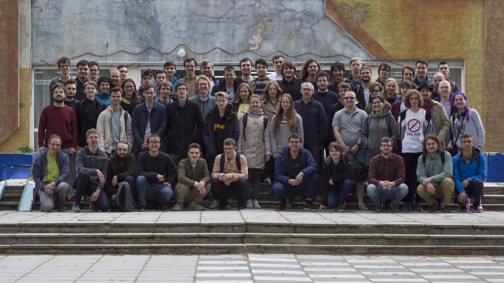

# Весенняя школа по математике и физике

[Записи докладов](../youtube/mathphysschool/playlists/Spr19)

## Дубна / 30 апреля – 8 мая 2019 г.

Официальная страница школы находится по адресу [https://crei.skoltech.ru/cas/ru/calendar-ru/conf190430ru/](https://crei.skoltech.ru/cas/ru/calendar-ru/conf190430ru/)

Школа планируется “рабочей”, ее программа будет состоять из докладов участников. Ниже в файле приблизительная программа школы. Темы, указанные со звёздочкой, не входят в обязательные для рассмотрения в рамках школы. Конечно, их изучение всячески приветствуется, и в случае желания участников мы их постараемся обсудить.

Желающим участвовать нужно до 3 марта заполнить форму. В этой форме надо указать 1-2 темы (и, по возможности, конкретные номера докладов), по которым они хотят сделать доклад во время школы. В случае любых затруднений или вопросов по темам - не стесняйтесь задавать вопросы консультантам (указаны после названий тем) или на адрес оргкомитета <MathPhysSchool@gmail.com> 

Мы хотим избежать ситуации, что все будут готовить одни и те же доклады, поэтому окончательное распределение докладов по участникам (внутри выбранных участниками тем) будет произведено организаторами. 

Количество тем ниже превышает возможности организаторов. Поэтому темы, на которые не наберется достаточное число докладчиков, в начале марта будут убраны из программы школы. 

Для подготовки к школе участникам необходимо до 1 апреля подготовить предварительные планы докладов, объёмом до 2 страниц. В планах надо явно написать основные формулы/утверждения, которые будут выводиться/объясняться на школе с пояснениями, и их иллюстрацию на конкретном примере (чем конкретнее - тем лучше). Планы нужно высылать на почту кураторам соответствующих тем (с копией на адрес оргкомитета <MathPhysSchool@gmail.com>), с темой письма “План доклада. <Фамилия>” . Предоставление планов и их достаточное качество будет являться основным условием, необходимым для участия в школе. План, помимо отправки на почту, также может быть лично обсуждён с куратором темы в Москве, при встрече по договорённости.

Поскольку объем материала в каждой теме велик, а времени на доклад - мало, просьба к участникам подходить к подготовке доклада внимательно, стараться заранее продумать изложение материала максимально понятным образом, иллюстрируя конкретными примерами, не перегружая деталями, несущественными для первого знакомства с темой.

## Программа школы
- [__Двойственность Шура-Вейля, двойственность Хау__](./SWH.md)
- [__Классическая интегрируемость на примере цепочки Тоды__](./Toda.md)
- [__Монополи и инстантоны__](./monopoles_instantons.md)
- [__Модель Изинга-I__](./ising1.md)
- [__Уравнение Янга-Бакстера, Q-операторы и разделение переменных__](./Yang_Baxter_Q.md)
- [__Грассман, Гизекер, Слодови__](./GGS.md)
- [__Топологическая теория струн__](./topstrings.md)
- [__Модель Изинга-II__](./ising2.md)
- [__Двумерные сигма-модели__](./sigma_models.md)
- [__Стохастические вершинные модели и вероятность__](./vertext_models.md)

## Курсы, которых не было
- [__Тороидальная алгебра__](./toroidal.md)

