# Целочисленные многогранники и алгебраическая геометрия

### Контакты:
* Федор Селянин <fed.se98@yandex.ru>

### Аннотация: 
Любому многочлену от нескольких переменных можно сопоставить многогранник Ньютона: выпуклую оболочку показателей ненулевых мономов. Оказывается многие свойства полиномов и задаваемых ими многообразий можно описать при помощи этих многогранников. Это очень красивые результаты, также они часто используются в других областях математики и математической физики.

Темы 1-4 связаны и в них перемежаются сюжеты из геометрии многогранников (1, 4i) и их алгебро-геометрические интерпретации (2, 3, 4ii). Точнее, тема 2 связана с задачей о числе корней в торе типичной системы из n полиномов от n переменных с заданными многогранниками Ньютона. Доказательство этой теоремы и её обобщений удобно интерпретировать на языке торических многообразий (тема 3). Тема 4 посвящена дискриминанту (поверхности в пространстве коэффициентов полиномов, которой соответствуют сингулярные многообразия), здесь мы следуем классической книге Гельфанда-Капранова-Зелевинского. В частности, мы покажем, что многогранник Ньютона дискриминанта является вторичным многогранником.

Темы 5,6 -- несколько обособленные сюжеты из геометрии выпуклых целочисленных многогранников (с вершинами в целочисленной решетке).

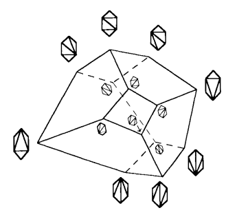 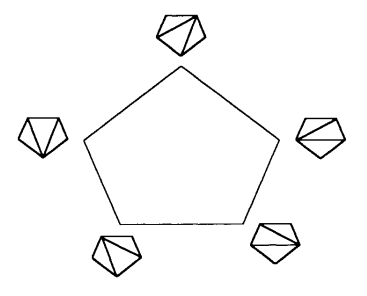 

### Пререквизиты:
гладкие многообразия, аффинная геометрия, конусы. Также для некоторых тем хорошо бы (но не обязательно) знать лемму Сарда и иметь начальные представления об алгебраической геометрии (на уровне понятия идеала и теорема Гильберта о нулях)

## Программа

1. Опорные функции, смешанный объем выпуклых тел.  
[EG] – параграф 1.4-1.5; 4.1, 4.3-4.4  
[EA2] – лемма 1.2  

2. Многогранники Ньютона полиномов, Теорема Кушниренко-Бернштейна о числе решений полиномиальной системы в торе, пример применения: размерность алгебры Якоби.  
[B]  
[M] – лемма об отборе кривых  

3. Комплексный тор, его характеры и однопараметрические подгруппы, изоморфизмы стандартных торов, торические компактификации, примеры.  
[KH] – параграф 1  

4. Дискриминанты, результанты и многомерные детерминанты.
   1. Выпуклые разбиения многогранника, вторичный многогранник, примеры, интерпретация вершин и ребер вторичного многогранника.  
[GKZ] – глава 7
   2. A-детерминант и A-дискриминант, их многогранники Ньютона.  
[GKZ] – глава 7,8  
[EA1] – параграфы 1.7-1.10  

### Литература
[A] В. И. Арнольд, Статистика целочисленных выпуклых многоугольников  
[B] Д. Н. Бернштейн, Число корней системы уравнений  
[M] Милнор Д. Особые точки комплексных гиперповерхностей  
[KH] А. Г. Хованский, Многогранники Ньютона и торические многообразия  
[EA1] А. И. Эстеров, Тропическая теория особенностей и геометрия многочленов с неопределенными коэффициентами  
[EA2] А. И. Эстеров, Newton polyhedra of discriminants of projections.  
[EG] Ewald G, Combinatorial convexity and algebraic geometry  
[GKZ] I. M. Gelfand, M. M. Kapranov, A. V. Zelevinsky, Discriminants, Resultants, and Multidimensional Determinants  
[HNP] Haase C, Nill B., Paffenholz A., Lecture Notes on Lattice Polytopes

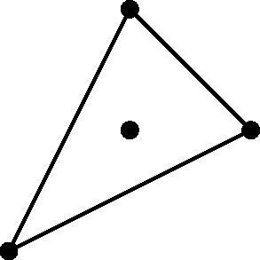 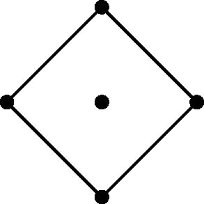 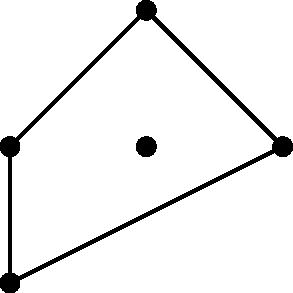 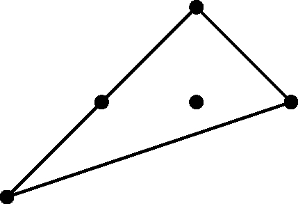 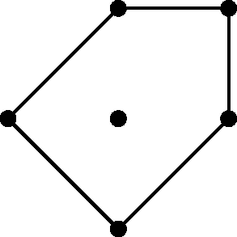 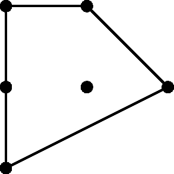 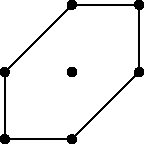 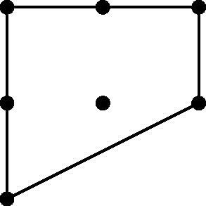 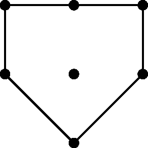 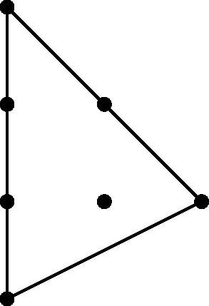 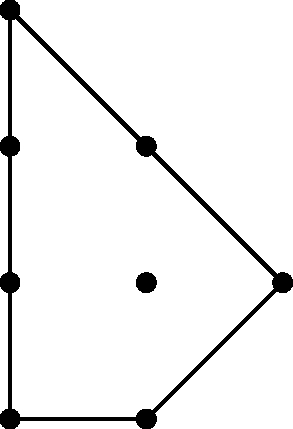 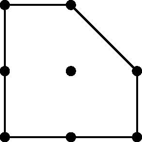 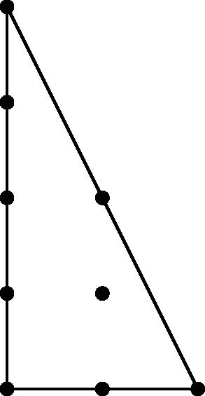 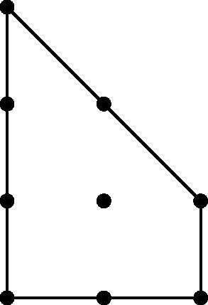 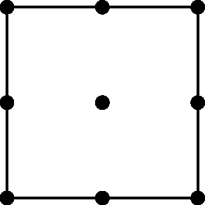 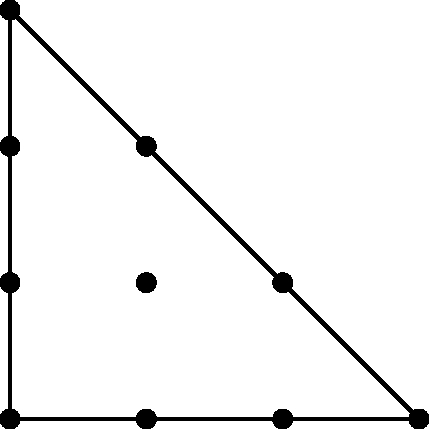 
