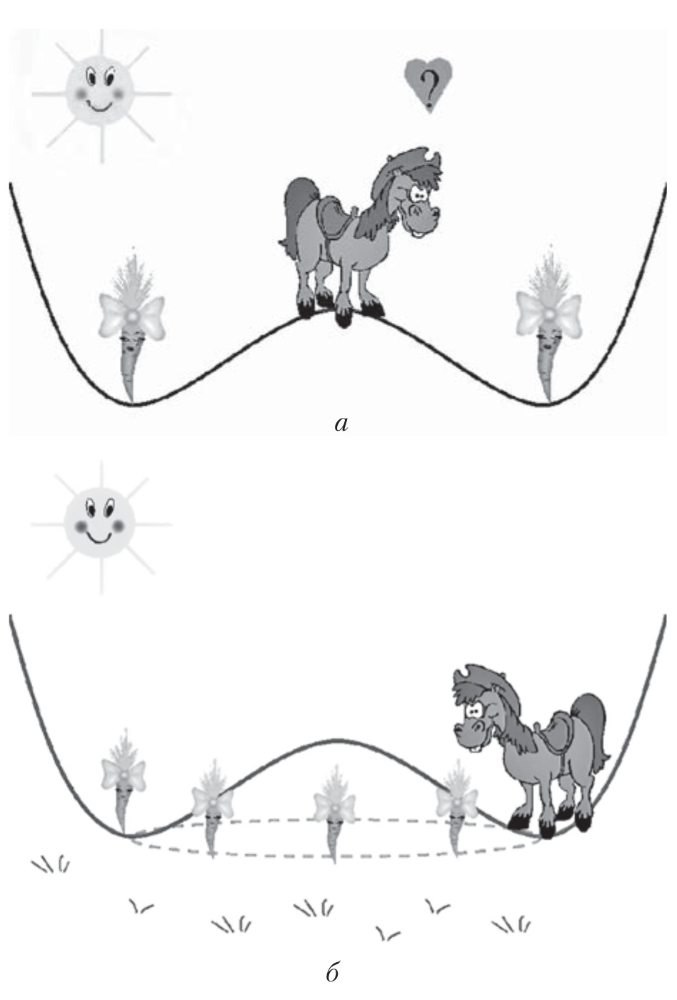

# Спонтанное нарушение симметрии  

### Контакты:  
* Иван Сечин <shnbuz@gmail.com>  

### Аннотация

Спонтанное нарушение симметрии системы — это явление, которое происходит в случае, когда вакуумное состояние системы оказывается менее симметричным, чем вид потенциальной энергии. Такое спонтанное нарушение можно найти, например, в механике: шарик, который находится посередине между двумя симметричными ямами, рано или поздно под действием возмущений скатится в одну из них и спонтанно нарушит симметрию.

Механизм Хиггса, который дает массу частицам, объясняется именно спонтанным нарушением симметрии, а это в некотором смысле единственный механизм, который может дать хорошую (унитарную и перенормируемую) квантовую теорию с массивными векторными бозонами, которые наблюдаются на эксперименте и известны как W и Z бозоны.

Мы познакомимся со спонтанным нарушением симметрии в рамках классической теории поля и изучим разные примеры и явления, которые происходят при таком нарушении.

### Пререквизиты  
Классическая механика в лагранжевом формализме, понятие о группах Ли в рамках главы 3 книжки Рубакова [R1], полезно знать классическую электродинамику.

## Доклады

1. Напоминание: основные понятия классической теории поля.  
Вещественное и комплексное скалярные поля, лагранжиан и действие теории со скалярными полями. 
Глобальные симметрии действия: абелевы и неабелевы. Калибровочная локальная симметрия, калибровочное поле. 
Взаимодействие скалярного и калибровочного поля, скалярная электродинамика.  
[R1] главы 2-4  
[T1] глава 1  
[BRW] глава 1  
[PS] главы 2, 15  

2. Спонтанное нарушение глобальных симметрий.  
Спонтанное нарушение U(1) симметрии в скалярной электродинамике, возникновение безмассового 
голдстоуновского бозона. Частичное нарушение глобальной симметрии от группы G до ее подгруппы H. 
Теорема Голдстоуна. Примеры систем, в которых происходит такое частичное нарушение.  
[R1] глава 5  
[BRW] главы 2-3  
[C] глава 5.2  

3. Спонтанное нарушение калибровочных симметрий.  
Скалярные поля в фундаментальном и в присоединенном представлении калибровочной группы, 
механизм Хиггса. Нарушение симметрии в электрослабой теории, появление массы у W- и Z-бозонов.    
[R1] глава 6  
[BRW] глава 7  
[C] глава 5.2  
[PS] глава 20

4. Фермионы.  
Фермионные поля, действие для фермионов. Уравнение Дирака, его связь с уравнением Клейна-Гордона.
Фермионы, взаимодействующие со скалярным и с калибровочным полем. Появление массы у фермионов через механизм Хиггса.  
[R2] глава 1  
[T1] глава 4  
[PS] глава 3

5. Пи-мезоны как голдстоуновские бозоны. (два доклада)    
SU(N_c) калибровочная теория с N_f безмассовыми фермионами-кварками, глобальная симметрия SU(N_f)xSU(N_f) 
и ее нарушение до диагональной подгруппы SU(N_f)_V кварковым конденсатом. 
Эффективный киральный лагранжиан для пионов.     
(\*) Учет ненулевых масс кварков, возникновение массы пионов.  
(\*) Скирмион как модель бариона.  
[R1] главы 5.5, 7.5    
[T2] глава 5  
[PS] глава 19.3 

[BRW] A.Beekman, L.Rademaker, J.Wezel. An Introduction to Spontaneous Symmetry Breaking, <https://arXiv.org/abs/1909.01820>  
[C] S.Coleman. Aspects of Symmetry.  
[PS] М.Пескин, Д.Шредер. Введение в квантовую теорию поля.  
[R1] В.Рубаков. Классические калибровочные поля. Бозонные теории.  
[R2] В.Рубаков. Классические калибровочные поля. Теории с фермионами. Некоммутативные теории.  
[T1] D.Tong. Lectures on Quantum Field Theory, <http://www.damtp.cam.ac.uk/user/tong/qft.html>  
[T2] D.Tong. Lectures on Gauge Theory, <http://www.damtp.cam.ac.uk/user/tong/gaugetheory.html>  
