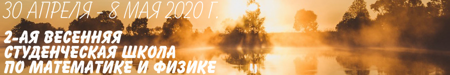

# Весенняя школа по математике и физике

## Zoom / 30 апреля – 8 мая 2020 г.

Официальная страница школы находится по адресу [https://crei.skoltech.ru/cas/ru/calendar-ru/200430r/](https://crei.skoltech.ru/cas/ru/calendar-ru/200430r/)

Школа планируется рабочей, каждый из участников школы должен будет сделать доклад по одной из предложенных тем. Подготовка докладов и качественные планы докладов — главное условие для участия в школе. Нужно отвечать на письма кураторов темы и продолжать работать над планом после того, как вы прислали предварительную версию.

В связи с эпидемией нового коронавируса школа будет проходить в онлайн формате. Этот формат для большинства из нас новый, потому просим более внимательно отнестись к подготовке.

### Рекомендации по поводу переноса школы в zoom:

- Для связи мы будем использовать zoom. Клиент под разные платформы можно и нужно скачать по адресу <https://zoom.us/>. Также нужно зарегистрироваться на сайте. Бесплатного аккаунта будет достаточно, так как у организаторов есть несколько аккаунтов более высокого уровня.

- Проверьте заранее, что у вас работают микрофон, наушники и всё остальное. Лучше всего пользоваться гарнитурой (микрофоном с наушниками). Если Вы пользуетесь микрофоном, находящимся в корпусе планшета или ноутбука, есть большой риск, что он будет передавать шум вентилятора, удары по корпусу, экрану, клавишам, и т.д. — проверьте, что такой проблемы нету.

- Назовитесь настоящим именем и поставьте настоящую фотографию на аватарку. Участники с никами типа BaNtYc911 и фотографией котика на аватарке не приветствуются.

- Когда вы не говорите, лучше выключать микрофон. У вновь подключающихся микрофоны, видимо, будут по умолчанию выключаться, также во время доклада модератор может выключить микрофоны тем, кто будет создавать шум. Если вы хотите использовать колонки, проверьте, что они не создают эха в комбинации с микрофоном.

- Может иметь смысл поставить zoom на несколько устройств и одновременно с них залогиниться: например, писать на планшете, а камеру и звук использовать на компьютере или на смартфоне. Для этого достаточно одного аккаунта.

### Различные опции для онлайн докладов:

- Можно сделать .tex презентацию, собрать из нее .pdf, а потом во время доклада показывать этот .pdf и, в случае необходимости, писать поверх этого .pdf (такая возможность есть почти во всех программах просмотра .pdf). Можно сделать презентацию в overleaf.com, показывать экран просмотра, а при необходимости что-то дописать или добавить, дописывать в tex-файл и перекомпилировать презентацию.

- Можно написать доклад на онлайн-доске, например, на idroo.com, а потом использовать эту доску во время презентации и что-то оперативно на ней дописывать.

- Можно писать на планшете со стилусом или на графическом планшете для компьютера прямо во время доклада, как будто на доске. В этом случае также желательно иметь какие-то заготовленные формулы или формулировки.

- Писать мышкой, в принципе, тоже можно, но только совсем небольшие комментарии, и только если у вас хорошо получается.

- В zoom'е есть своя доска, но она, видимо, годится только для небольших комментариев по ходу обсуждения. Кроме отдельной доски в zoom'е есть опция "Annotate", доступная как докладчику, так и участникам, которая позволяет писать комментарии поверх экрана (т.е., они не связаны с транслируемым изображением, и их потом нужно вытирать).

- Заготовленные перед докладом файлы или ссылки на доску/overleaf стоит в начале доклада посылать в чат zoom'а. При этом лучше заранее всё сконвертировать в .pdf, т.к. что-то менее стандартное половина участников не сможет открыть.

- Идея писать на доске и снимать её камерой может быть плохой: это зависит от качества и размера доски, от камеры и освещения. Ещё может быть можно снимать камерой на штативе листочки с записями, лежащие на столе. Гарантий, что это будет работать, у нас нету, поэтому если вы хотите делать так, нужно экспериментировать и согласовывать с кураторами.

- Если у вас есть какие-то другие идеи относительно онлайн докладов, проверьте, пожалуйста, их работоспособность и напишите на адрес оргкомитета: нам тоже интересно.

- Независимо от того, какой из вариантов доклада вы выберете, нужно заранее показать кураторам текст и/или презентацию, а также протестировать с ними формат доклада.

## Программа школы
- [__Теория групп и атом водорода__](./hydrogen.md)
- [__“Инстантоны” (вихри и монополи) в фазовых переходах__](./BKT.md)
- [__Симметрические функции и бозон-фермионное соответствие__](./boson_fermion.md)
- [__Гамильтонова редукция: примеры__](./hamiltonian_reduction.md)
- [__Разделение переменных на примере цепочки Тоды__](./sep_var.md)
- [__Анионы__](./anyons.md)
- [__Базисы Гельфанда–Цетлина__](./Gelfand_Tsetlin.md)
- [__Термодинамический Бете анзац__](./tba.md)
- [__Локализационное вычисление инстантонных статистических сумм__](./localization.md)
- [__Теория Дональдсона–Томаса и локализация__](./DT.md)

