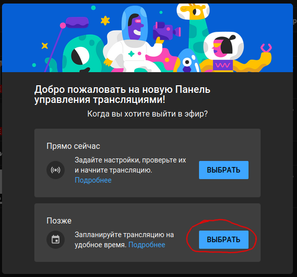
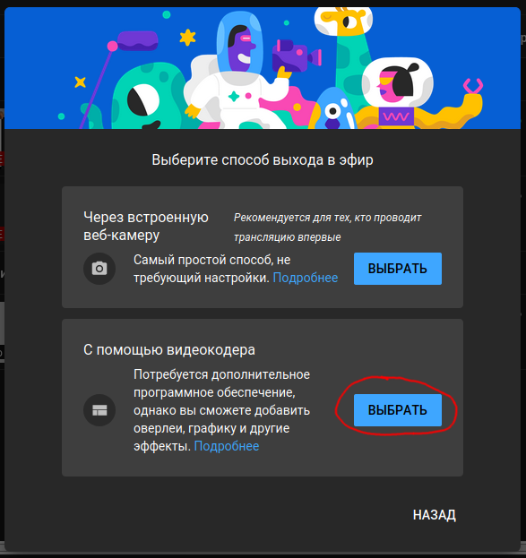
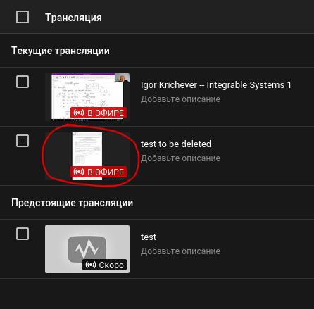
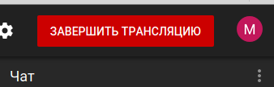

[**Назад** (рекомендации по пользованию зумом)](../zoom_tips.md#stopstream)
## Что делать если не получатся завершить трансляцию на ютубе:

После этого окно изчезает, ничего запускать не надо.

Дальше нужно выбрать свой стрим и нажать на его значок:

На открывшейся странице нажать завершить:

[**Назад** (рекомендации по пользованию зумом)](../zoom_tips.md#stopstream)
