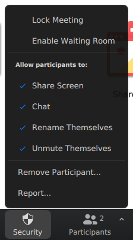

# Рекомендации по пользованию зумом

Необязательно делать всё, что написано внизу.
Это скорее список опций, на которые стоит обратить внимание.
Словом *конференция* ниже всегда называется зум-конференция, которая в английской версии *meeting*.

## Содержание:
- [Настройки в личном кабинете](#настройки-в-личном-кабинете)
- [Настройки в клиенте зума](#настройки-в-клиенте-зума)
- [Создание конференции](#создание-конференции)
- [Полезные опции во время конференции](#полезные-опции-во-время-конференции)
- [Запись конференций](#запись-конференций)
- [Выкладывание видео на ютуб](#выкладывание-видео-на-ютуб)
- [Трансляции на ютуб](#трансляции-на-ютуб)
- [Другие советы](#другие-советы)

## Настройки в личном кабинете

<a name="i00"></a>Нужно пойти на <https://zoom.us/>, залогиниться (*sign in*), зайти в *My account*/*Моя учетная запись* и поменять часть настроек[.](#i00)


- <a name="i01"></a>На вкладке *Profile* настроить формат даты и времени, поставить фотографию, выбрать язык. Проверить, что *User Type -- Licensed*/*Тип пользователя -- Лицензионная версия* (если вы преподаватель и зашли под институтским аккаунтом).

  Все остальные настройки на вкладке *Settings*/*Настройки*.
  Они перечислены в том же порядке, в котором встречаются на странице.
  Чтобы найти конкретную настройку, можно нажать в браузере Ctrl+F (поиск по странице) и начать набирать какой-то кусок из её названия[.](#i01)

- <a name="i02"></a>*Waiting room*/*Зал ожидания* -- лучше отключить.
Иначе можно замучиться пускать слушателей руками.
В случае чего это включается и отключается во время конференции.

  Кроме того, бессмысленно комбинировать включенную *Waiting room*/*Зал ожидания* и *Join before host*/*Вход раньше организатора*, т.к. всё равно участников будет некому пустить[.](#i02)

- <a name="i75"></a>Все настройки, в которых встречается "require passcode"/"требовать ... код" -- отключить.
Мы не знаем случаев когда кто-то попадал на конференцию просто перебирая ID, потому пока незачем ставить пароли на те конференции, ссылки на которые не публикуются открыто[.](#i75)

- <a name="i03"></a>*Only authenticated users can join meetings*/*К конференциям могут подключаться только авторизованные пользователи* -- лучше включить.  
Pro: это стимулирует людей нормально зарегистрироваться, с именем и фамилией (а не поставить точку вместо имени, и пусть остальные узнают по голосу).  
Contra: кто-то может не справиться[.](#i03)

- <a name="i04"></a>*Audio type*/*Способ подключения к аудио-конференции* -- кажется, лучше поставить *Computer only*.
По-моему, опцией "подключиться через телефонный звонок" никто не пользуется, хотя она работает, и может даже когда-то оказаться полезной[.](#i04)

- <a name="i05"></a>*Join before host*/*Вход раньше организатора* -- включить.
Участникам легче понять, что они зашли по правильной ссылке, когда они видят друг друга до прихода организатора.
Кроме того, при включении этой опции ссылкой смогут пользоваться для обсуждений без ограничения по времени те, у кого нету платных аккаунтов[.](#i05)

- <a name="i06"></a>*Use Personal Meeting ID (PMI) when starting an instant meeting*/*Использовать идентификатор персональной конференции (PMI) для начала мгновенной конференции* -- эта опция может быть полезной если вы хотите, чтобы оранжевая кнопка *New Meeting*/*Новая конференция* всегда генерировала одну и ту же ссылку (если я правильно понял, на что она распространяется).  
Pro: не нужно каждый раз посылать новую ссылку когда хотите с кем-то говорить.  
Contra: все, у кого ваша ссылка уже есть, могут случайно в любой момент присоединиться к разговору.
Кроме того, эта опция включается/отключается в клиентах зума, потому здесь её можно не трогать[.](#i06)

- <a name="i07"></a>**Важно.** *Mute participants upon entry*/*Отключать звук участников после входа* -- включить.
Иначе вновь подключающиеся могут создавать шум[.](#i07)

- <a name="i08"></a>**Важно.** *Sound notification when someone joins or leaves*/*Звуковое уведомление, когда пользователь подключается к конференции или покидает ее* -- проверить, чтобы было отключено.
Иначе эти звонки очень мешают[.](#i08)

- <a name="i09"></a>**Важно.** *Co-host*/*Соорганизатор* -- включить (работает только в платных или институтских аккаунтах).
Это нужно для того, чтобы можно было назначить кого-то соорганизатором во время конференции[.](#i09)

- <a name="i10"></a>*Polling*/*Опросы* -- лучше отключить.
По-моему, эти голосования какие-то странные, только место на панели будут занимать[.](#i10)

- <a name="i11"></a>**Важно.** *Screen sharing*/*Демонстрация экрана* -- включить.
В обоих местах отметить *All participants*.
Иначе во время конференции показывать экран сможет только организатор[.](#i11)

- <a name="i12"></a>*Nonverbal feedback*/*Невербальная обратная связь* -- забавная, но довольно бесполезная опция (позволяет ставить участникам разные значки)[.](#i12)

- <a name="i13"></a>*Breakout room*/*Сессионный зал* -- это опция, которая позволяет рассадить участников в несколько разных комнат.
Если это не нужно, лучше отключить, чтобы лишней кнопки не было[.](#i3)

- <a name="i14"></a>**Важно.** *Allow live streaming meetings*/*Разрешить трансляцию конференций* -- должно быть включено, отметить *YouTube*.
Эта опция есть только в платных или институтских аккаунтах[.](#i14)

- <a name="i15"></a>*When attendees join meeting before host*/*При входе участников в конференцию раньше организатора* -- лучше отключить уведомления, чтобы почту не забивали[.](#i15)

## Настройки в клиенте зума

- <a name="i16"></a>*Video -> Turn off my video when joining meeting*/*Видеоизображение -> Выключать моё видео при входе в конеренцию* -- включить.
Лучше включать видео самому когда это нужно[.](#i16)

- <a name="i17"></a>*Video -> Always dispaly participants names on their video*/*Всегда показывать имена участников на видеоизображении* -- включить[.](#i17)

- <a name="i18"></a>*Video -> Enable HD*/*Включить режим HD* -- вроде можно включить сразу.
Точно нужно включать если не устраивает качество видео[.](#i18)

- <a name="i19"></a>**Важно.** *Audio -> Mute my microphone when joining meeting*/*Звук -> Отключить звук моего микрофона при подключении к конференции* -- включить.
Если этого не сделать, можно привыкнуть за время многих конференций, в которых включено *Mute participants upon entry*, что микрофон по умолчанию отключен, а потом все услышат, как вы режете салат[.](#i19)

- <a name="i20"></a>*Automatically join audio by computer when joining a meeting*/*Автоматиески подключать звук моего микрофона при подключении к конференции* -- зависит от того, как вы пользуетесь зумом.
Если заходить с нескольких устройств, эту опцию лучше отключить и нажимать руками *join audio*/*подключить звук* на том устройстве, на котором нужно.

  *Join audio*/*Подключить звук* означает подключение и микрофона, и динамика, *mute/unmute*/*Включить звук/Выключить звук* влияет только на микрофон.
От аудио потом можно отключиться.
Если несколько устройств сразу подключены к аудио, звук из динамика одного устройства будет попадать в микрофон другого и получится эхо с задержкой в 3 секунды[.](#i20)

## Создание конференции

- <a name="i21"></a>На вкладке *Meetings -> Upcoming*/*Конференции -> Предстоящие* найти и нажать кнопку *Schedule a meeting*/*Запланировать конференцию*[.](#i21)

- <a name="i22"></a>*When, Duration*/*Когда, продолжительность* -- написать какое-то время. Оно, на самом деле, ни на что не влияет, по ссылке можно будет зайти в любое время[.](#i22)

- <a name="i23"></a>*Recurring meeting*/*Повторяющаяся конференция* -- включить[.](#i23)

- <a name="i24"></a>*Recurrence -- Weekly*/*Повторение -- Еженедельно*[.](#i24)

- <a name="i25"></a>*End date*/*Дата завершения* -- выбрать в календаре самую позднюю дату, какая есть (обычно это через год).
Это нужно чтобы ссылка подольше жила.
Она будет активной ещё где-то полгода после даты окончания[.](#i25)

- <a name="i26"></a>*Registration, Waiting room*/*Регистрация, Зал ожидания* -- не надо включать[.](#i26)

- <a name="i27"></a>*Passcode*/*Код доступа* -- если вы нигде не собираетесь публиковать ссылку в открытую, не надо его включать.
Если собираетесь, то можно поставить[.](#i27)

- <a name="i28"></a>**Важно.** Когда вы публикуете ссылки на конференции с паролем в открытом доступе, следите, чтобы в конце не было *?pwd=...*, иначе этот пароль теряет смысл, т.к. он будет в ссылке[.](#i28)

- <a name="i29"></a>*Video*/*Видео* -- везде *off*/*выкл*.
Участники сами смогут включить если будет нужно[.](#i29)

- <a name="i30"></a>*Audio -- Computer audio*/*Звук -- Звук компьютера*, если нету людей, которые хотят подключаться по телефону[.](#i30)

- <a name="i31"></a>*Enable join before host*/*Включить вход раньше организатора* -- включить[.](#i31)

- <a name="i32"></a>**Важно**. *Mute participants upon entry*/*Выключать звук участников при входе* -- включить[.](#i32)

- <a name="i33"></a>*Only authenticated users can join*/*Могут подключаться только авторизованные пользователи* -- включить[.](#i33)

- <a name="i34"></a>*Automatically record meeting*/*Записывать конференцию автоматически* -- это можно включить, отметив *In the cloud*/*В облако*.  
Pro: не нужно запускать запись руками.  
Contra: будет замусориваться облако.  
Contra: может быть вы её и руками запускать не хотите[.](#i34)

## Полезные опции во время конференции

- <a name="i35"></a>На вкладке *Meetings*/*Конференции* есть кнопки для запуска ранее назначенных конференций. Но в принципе точно так же можно зайти и по ссылке[.](#i35)

  

- <a name="i36"></a>На вкладке *Home*/*Главная*, у кнопки *New Meeting*/*Новая конференция*, которая создаёт мгновенные конференции (чтобы с кем-то прямо сейчас поговорить), есть опция *Use My Personal Meeting ID (PMI)*/*Использовать мой идентификатор персональной конференции (PMI)* -- если она включена, ссылка на мгновенную конференцию будет всегда одна и та же, если выключена -- каждый раз будет генерироваться новая.  
Настройки той конференции, которая по *PMI*, находятся на <https://zoom.us/> на вкладке *Конференции -> Персональная комната*[.](#i36)

  

- <a name="i37"></a>Под списком участников (который открывается кнопкой *Participants*/*Участники*) есть меню (кнопка с тремя горизонтальными точками).
В нём можно прямо во время конференции менять часть настроек.

  Ещё полезная кнопка под списком участников *Mute all*/*Выкл. весь звук* -- она отключает всем микрофоны, желающие могут включить их назад сами.
Может быть полезно, если у кого-то лает собака, но непонятно, у кого[.](#i37)

  

- <a name="i38"></a>В меню *More*/*Дополнительно*, которое появляется если навестись на участника в списке, есть опция дать ему права *организатора* (*Host*) или *соорганизатора* (*Co-host*)[.](#i38)

  

- <a name="i39"></a>В меню кнопки *Security*/*Безопасность* есть разные опции, помогающие бороться с вторжением посторонних:
  - *Lock Meeting*/*Заблокировать конференцию* -- запрещает подключаться новым участникам.
  - *Enable Waiting Room*/*Вкл. зал ожидания* -- участников надо будет пускать вручную.
  - *Remove Participant*/*Удаление участника...* -- выгнанный участник больше не сможет подключиться, если только в настройках не включить *Allow removed participants to rejoin*/*Разрешить удаленным участникам повторное подключение*.
Потому применяйте только против тех, кого действительно не хотите видеть[.](#i39)

  

- <a name="i40"></a>Настройки демонстрации экрана на время данной конференции (кто может, кто не может показывать) находятся в меню кнопки *Share Screen -> Advanced Sharing Options...*/*Демонстрация экрана -> Раширенные параметры совместного использования...*.
Чтобы его вызвать, нужно сначала нажать на маленькую стрелку вверх в правом верхнем углу кнопки[.](#i40)

  
  
- <a name="i41"></a>В меню правой кнопки мыши у видео участника есть полезная опция *Spotlight Video*/*Отслеживать видео*.
Она закрепляет это видео для всех, т.е., все видят его, а не видео говорящего сейчас участника:

  

  Это может быть нужно сделать когда докладчик рассказывает возле доски или показывает листочки с записями.
  Другой случай -- когда звук идёт не с того устройства, с которого видео (по умолчанию зум показывает видео или аватарку того, кто сейчас говорит).
  
  Похожая опция *Pin Video*/*Закрепить видео* -- она закрепляет видео только для того, кто ею пользуется.
  В частности, на то, какая картинка будет транслироваться на ютуб, она не повлияет (в отличие от *Spotlight Video*/*Отслеживать видео*)[.](#i41)

- <a name="i42"></a>Периодически бывает, что кому-то не видно край доски.
Если у остальных всё нормально, нужно или выйти из полноэкранного режима на компьютере, или на планшете пальцами поменять масштаб (сжать-растянуть)[.](#i42)

- <a name="i43"></a>Полезная опция -- *Gallery view*/*Вид галереи*.
Она позволяет видеть сразу нескольких участников разговора[.](#i43)

- <a name="i44"></a>Опция отправки файла -- в меню чата, которое вызывается кнопкой с тремя горизонтальными точками над полем ввода сообщения (сам чат открывается кнопкой *Chat*/*Чат*):
  
  
  
  Участники, зашедшие позже, не видят ни файлов, ни сообщений, отправленных до того.
  Файлы можно принимать только на компьютерах, клиенты зума для планшетов и телефонов этого не умеют[.](#i44)

## Запись конференций

Всего есть три опции как записывать конференции:

1. <a name="i45"></a>Себе на компьютер (*Record on this Computer*/*Записывать на этот компьютер*).
Не рекомендуется, т.к. связь может быть нестабильной, компьютер может зависнуть, видео потом будет перекодироваться, и на его перекодирование на слабом компьютере может уйти больше времени, чем изначально на запись[.](#i45)

2. <a name="i46"></a>В облако (*Record to the Cloud*/*Запись в облако*).
Важно помнить, что эти записи могут храниться только **14 дней**, потому лучше их сразу сохранять себе (они появляются через какое-то время после окончания конференции).  
Как скачать запись:
   - Пойти на вкладку *Recordings*/*Записи* <https://zoom.us/recording>.
   - Для того, чтобы скачать запись себе на компьютер, нажать *More -> Download*/*Подробнее -> Загрузить*.
   - Для того, чтобы дать кому-то ссылку на скачивание, нажать *Share...*/*Совместное использование...*, дальше можно отключить *Passcode protection*/*Защита кода доступа*.
После этого нажать *Display detailed information*/*Показать подробную информацию* и скопировать оттуда ссылку, или нажать *Copy sharing information to clipboard*/*Скопировать информацию для совместного использования в буфер обмена*[.](#i46)

     

3. <a name="i47"></a>[Транслировать на ютуб](#трансляции-на-ютуб).
При этом запись там автоматически сохраняется, и её при желании можно скачать.
Это самый простой способ, по принципу "нажал и забыл".  
На всякий случай можно одновременно с этим писать в облако (да простят нас админы Сколтеха).
Обычно ютуб работает нормально, но изредка бывает, что трансляция не запускается, или сохраняется в худшем качестве[.](#i47)

## Выкладывание видео на ютуб

- <a name="i48"></a>У нас есть канал [Mathematical Physics School](https://www.youtube.com/channel/UCRACd55YrSwO8Fuy4Nx2oAA).
Если вы хотите выкладывать записи туда, напишите на <pasha145@gmail.com> или на <mbersht@gmail.com> -- мы можем открыть ограниченный доступ, для которого не нужен пароль от канала[.](#i48)

- <a name="i49"></a>Выкладываются видео вот этой кнопкой[:](#i49)

  

- <a name="i50"></a>Желательно под каждый курс создать отдельный плейлист и указывать его при выкладывании[.](#i50)

- <a name="i51"></a>Канал на ютубе есть у всех, к кого есть почта гугла.
Если вы хотите выкладывать видео на свой канал, нужно подтвердить номер телефона, иначе ютуб ставит довольно маленькое ограничение по длине видео[.](#i51)

## Трансляции на ютуб

- <a name="i52"></a>Для того, чтобы транслировать записи на ютуб на [Mathematical Physics School](https://www.youtube.com/channel/UCRACd55YrSwO8Fuy4Nx2oAA), нужно сначала получить пароль от канала.
Для этого надо написать на <mbersht@gmail.com> или на <pasha145@gmail.com>[.](#i52)

- <a name="i53"></a>Для того, чтобы запустить трансляцию, нужно быть именно хостом, а не ко-хостом (это одно из немногих действий, которые может делать только хост).
Права хоста можно передать[.](#i53)

- <a name="i54"></a>Трансляции есть только в платных или институтских аккаунтах[.](#i54)

- <a name="i55"></a>Трансляцию можно запустить только из зума на компьютере.
Остановить её можно с любого устройства. Запись в облако тоже запускается с любого устройства[.](#i55)

- <a name="i56"></a>Для запуска трансляции нужно нажать *Live on YouTube*/*Трансляция на YouTube*.
После этого откроется окно браузера[.](#i56)

  

- <a name="i57"></a>В браузере нужно проверить, что оно будет транслироваться на Mathematical Physics School, а не на ваш личный канал (если только вы не хотите транслировать именно на свой канал, или ещё какой-то)[.](#i57)

  

- <a name="i58"></a>Для того, чтобы сменить аккаунт, надо нажать *Not me*.
В появившемся окне выбрать "Mathematical Physics School" или залогиниться в него[.](#i58)

  

- <a name="i59"></a>Название видео должно быть не длиннее 100 символов.
Его потом можно менять.
Лучше включать в название не только номер, но и тему лекции[.](#i59)

- <a name="i60"></a>Опции трансляции:
  - *Public* -- видно всем.
  - *Unlisted* -- видно только тем, у кого есть ссылка на видео. Ссылку можно посмотреть или в тот момент, когда открывается проигрыватель, или потом найти на канале, или посмотреть в меню значка "YouTube" или "LIVE" в окне конференции.
  - *Private* -- видно только тем, у кого есть доступ к каналу[.](#i60)

- <a name="i61"></a>После того, как нажать *Go Live!*, открывается проигрыватель ютуба с трансляцией.
В зависимости от настроек браузера видео в нём может проигрываться.
Тогда его нужно остановить, иначе будет невозможно существовать: получится эхо с задержкой в 40 секунд.
Вообще вкладка с проигрывателем не нужна, её можно сразу и закрыть[.](#i61)

- <a name="i62"></a>Трансляцию можно остановить раньше, чем закончится конференция.
Это делается в меню значка "YouTube" или "LIVE" в окне конференции[:](#i62)

  

- <a name="i76"></a>После того, как трансляция закончилась, желательно завершить её ещё и на ютубе (иначе будет транслироваться чёрный экран).
Это делается в <https://studio.youtube.com/> -> *Videos* -> *Live* -> *View in Live Dasboard*.
Там нужно нажать *END STREAM*.
Это не очень принципиально, трансляцию может кто-то позже завершить[.](#i76)

  

  <a name="stopstream"></a>Если такой способ завершения не работает (всё закрыто окном, в котором предлагается начать какой-то новый стрим), то это проблема ютуба.
  Способы борьбы с ней:
  - От окна можно избавиться, нажимая на кнопки как в этой [инструкции](./stop_stream_problems/stop_stream_problems.md).
  - Если такая проблема будет возникать в дальнейшем, может быть удобнее сразу [заходить по прямой ссылке](https://studio.youtube.com/channel/UCRACd55YrSwO8Fuy4Nx2oAA/livestreaming/manage).


- <a name="i63"></a>Видео с ютуба можно скачать (в меню с вертикальными тремя точками, справа от  *View in Live Dasboard*)[.](#i63)

- <a name="i64"></a>Там же рядом есть иконка с карандашом, которая позволяет редактировать название и описание.
Если есть записки, имеет смысл выкладывать их на гугл диск, а в описание класть ссылку[.](#i64)

- <a name="i65"></a>Видео на ютубе можно обрезать с помощью ютубовского редактора[.](#i65)

- <a name="i66"></a>Можно попробовать транслировать на свой канал, но есть опасения, что если у канала мало подписчиков, или ещё чего-то не хватает, ютуб может обрывать трансляции через несколько минут после начала (сталкивались с такой проблемой).
В любом случае, записи на других каналах можно собирать в плейлисты на Mathematical Physics School[.](#i66)

- <a name="i67"></a>Канал на ютубе есть у всех, к кого есть почта гугла.
Для того, чтобы транслировать на него, нужно за 24 часа до этого, будучи залогиненным, нажать на ютубе на кнопку *Go live* -- тогда ютуб подождёт и активирует эту функцию.
Попробуйте поэкспериментировать: если с вашим каналом проблем не будет, может быть лучше транслировать на него[.](#i67)

- <a name="i68"></a>Имеется ещё альтернативный вариант, транслировать на фейсбук (это нужно включить в настройках)[.](#i68)


## Другие советы

- <a name="i69"></a>Если что-то не работает, попробуйте обновить клиент зума[.](#i69)

- <a name="i70"></a>Обновление в Линуксе сделано криво (точнее, никак не сделано).
Например, в Ubuntu нужно сначала скачать DEB пакет с сайта зума[:](#i70)

  
  
  После этого в папке, в которой он лежит, запустить в терминале

  ```
  sudo apt install ./zoom_amd64.deb
  ```
	
- <a name="i71"></a>В зум можно зайти одновременно с планшета, компьютера и телефона. Например, если на компьютере звук плохой, можно заменить его звуком с телефона[.](#i71)

- <a name="i72"></a>Клиенты зума под разные системы довольно сильно отличаются, как уровнем глючности, так и наличием/отсутствием функций.
Потому если есть несколько устройств с разными системами, лучше попробовать все и выбрать то, которое лучше[.](#i72)

- <a name="i73"></a>PDF файлы лучше открывать в программе, в которой можно писать поверх них[:](#i73)
  - Linux: Xournal, Xournal++
  - Windows: ???
  - iOS: GoodNotes может импортировать PDF, и дальше на нём можно писать
  - macOS: ???
  - Android: ???
  - Windows, macOS, Linux: бесплатный [Foxit Reader](https://www.foxitsoftware.com/pdf-reader/)
  
- <a name="i74"></a>Программы, в которых просто можно писать[:](#i74)
  - Windows, macOS, iOS, Linux, Android: [Stylus Labs Write](http://www.styluslabs.com/)
  - iOS: GoodNotes
  - ???

Вопросы, замечания и комментарии по поводу этого текста можно писать на <pasha145@gmail.com>.

Текст потом может обновляться.

[**[Наверх]**](#содержание)
